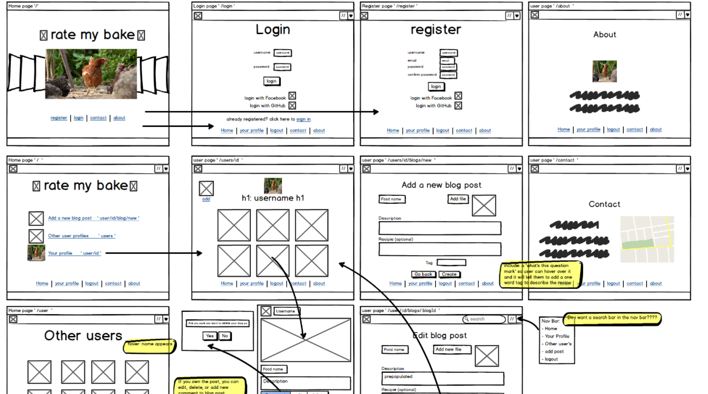

# Rate my Bake

GA WDI London - Project 2

####Approach / How It Works

- To keep it minimal, the users start on the homepage and have one link which they can use to login.  Otherwise, the drop-down menu above gives the other links and there is also a footer with home, login, register, about and contact.

- Users can either register their email address, or sign in using either GitHub or Facebook.  By logging in with Facebook and GitHub, I'm able to import their profile pictures to add to their user profile page, if not, I've added a default picture that is loaded instead.

- when they've logged in, they are sent back to the homepage but now there are additional links at the base of the page and the nav bar links has also changed meaning that the user can add a blog, view all the blogs, view the other user profiles or view their own profile.

- From most pages, the user is prompted to add a new blog.

- When the user looks at their profile, they can add or delete their blog.  If they add a comment, they are also able to add or delete the comment they added. Only owners of ether blogs or comments can edit or delete.

- On each blog page (each dish), I've used a recipie API that takes the dish tag and searches for recipes that include that keyword.  The recipe links are then displayed on the page under the dish desription.

- There is also a contact page and an about page which are static.



####The Build

- I started wire framing on paper and moved those pages to Balsamiq.

- I began the app by creating the restful routes and pages, then linked it to my database, heroku and GitHub.

- Once the pages and links worked together, I added the image uploader using AWS to the 'new blog' page.  I added conditions so that blogs could only be edited by the owners.

- I then added authentication so users would need to be logged into use the app.  I then looked at adding Facebook and GitHub logins using their documentation.

- Comments feature was added, and conditions so that only the owner of the comment could delete that comment.  Conditions were also added to the blogs so that blogs could only be edited or deleted by the owners of that blog.

- I also added authentication features meaning that (inc getting blogs to edit or not depending on whether it’s your app)

- Lastly I looked at testing the app which proved more complicated than first imagined.  The test data was created such that a user created 2 blogs, due to time constraints, I was only able to test the index page and am still working on the '/blogs' page.

#### Problems & Challenges

- Testing was more difficult than I imagined as there was no two models and the validation became an obstacle.  

- The size of images, meant I used up Heroku's storage limit quickly, I'd use links next time rather than store them in my app.

#### Blockers and Unsolved Problems

- Due to the Heroku's storage restriction, I couldn’t add a nice photo for the Edit page's background, instead I used the same as the 'Add Dish' page and for some unknown reason, despite identical classes and id's, it doesn’t show the apples image.

- Delete Account button doesn't work.

#### Future Changes and Additional features

- I'd like to make it more interesting and add some more APIs, such as:

- Instagram API - Using the tag feature, I would like to be able to search for trending photos of this recipe.  e.g. if the dish was a chocolate brownie recipe, I'd like to be able to display Instagram images of brownies.  The only downside of this is that I've found that Instagram users tend to hashtag a lot and a few of these may not be relevant, especially if the dish tag was vague such as 'buns' or 'cream'...

- Google Maps API; Adding an option after the recipe API where the user can click on the 'search' button where they will be taking to another page which displays a map showing all their nearest supermarkets where they could buy the ingredients for the recipe they've just found.

- Edit comment form.

- Rather than being taken to a 'show' page with the blog on it, it would have been nicer to have the blog pop out at you instead. (Mixins)

- Giving users the option to rate other recipes with stars.  This is in the user model but I didn't add it to the app in the end, but would still like to.

- Creating a 'Rate my Bake' logo.

####Resources

- All Images were taken from https://unsplash.com

